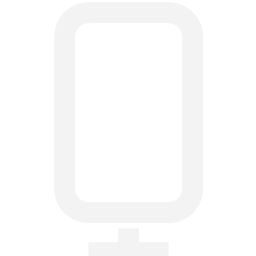
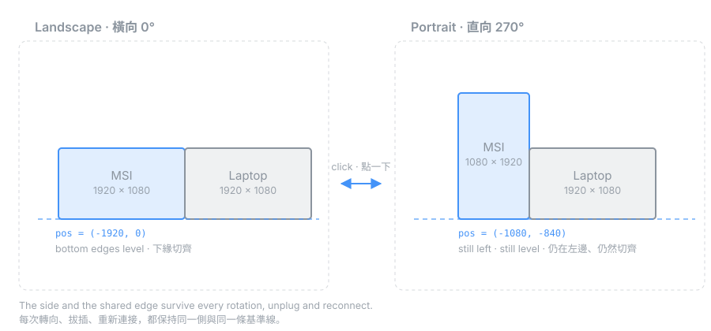

<div align="center">



# Portable Monitor Rotate

**在工作列點一下，攜帶式螢幕就在橫向與直向之間切換 —— 而且位置不會跑掉。**

[](LICENSE)
[](#)
[](https://github.com/Imchiajui/portable-monitor-rotate/releases/latest)
[](#)

[English](README.md) · [下載 .exe](https://github.com/Imchiajui/portable-monitor-rotate/releases/latest)

</div>

---

## 問題

攜帶式 USB-C 螢幕轉成直向非常好用 —— 寫程式、看文件、開聊天室、盯 log。但這類螢幕**大多沒有方向感應器**，Windows 永遠不會幫它自動旋轉。你只能每次都打開**設定 → 系統 → 顯示器**，選螢幕、改方向下拉選單、再按確認。

然後 Windows 會把它搬走。1920×1080 轉成 1080×1920，形狀變了，Windows 就重排整個虛擬桌面，把你的螢幕丟到別的地方。你明明把它擺在左邊、跟筆電切齊，轉一次方向就飄到半個螢幕高的位置。

這是一支 49 KB 的常駐小工具，兩個問題一起解決。



## 功能

- **點一下工作列圖示**就切換橫向 ↔ 直向。就這樣。
- **圖示會顯示目前狀態** —— 寬的長方形或直立的長方形。
- **位置會被保留。** 螢幕維持在你放的那一側（左／右／正上方／正下方），並緊貼共用邊，轉向、拔線、重新連接都不變。
- **斷線後記得回原位。** 拔掉螢幕，圖示消失；接回來，圖示回到**工作列上同一格**，螢幕也回到桌面上同一個位置。
- **游標不會亂跳。** 改變顯示模式原本會把指標拉到主螢幕正中央，這裡不會。
- **英文／繁體中文介面**，預設跟隨 Windows 顯示語言。
- **可被腳本驅動** —— 提供命令列與 named pipe，AutoHotkey、Stream Deck 或你自製的硬體都能操控。
- **免安裝、無相依、無遙測、不連網。** 單一 .exe，跑在 Windows 內建的 .NET Framework 4.x 上。

## 安裝

1. 到 [最新 Release](https://github.com/Imchiajui/portable-monitor-rotate/releases/latest) 下載 `MonitorRotateTray.exe`。
2. 放到一個**固定不會再搬動**的資料夾，例如 `C:\Users\<你>\Tools\MonitorRotateTray\`。
3. 執行。想要開機自動啟動，就在圖示上按右鍵 →「**開機自動啟動**」。

> **先決定資料夾，再開自動啟動。** 有兩樣東西綁定 exe 的完整路徑：Windows 的自動啟動登錄項，以及托盤圖示記住的位置。之後搬動 exe，兩者都會失效 —— 自動啟動會靜默失敗，圖示位置也會被重設一次。

> **關於 SmartScreen。** 這支程式沒有經過程式碼簽章，所以第一次執行時 Windows 會跳出藍色的「Windows 已保護您的電腦」畫面。點「**其他資訊 → 仍要執行**」即可，或是[自己編譯](#自行編譯)（一個檔案、一行指令）。每個 Release 都附上 SHA-256，可以自行核對下載到的檔案。

## 使用方式

| 操作 | 結果 |
|---|---|
| **左鍵**點圖示 | 在兩個方向之間切換 |
| **右鍵** | 選單：四個角度、目標螢幕、位置與對齊、語言、開機自動啟動 |
| 滑鼠停留 | 顯示螢幕名稱與目前方向 |

介面語言預設跟隨 Windows 顯示語言 —— 中文系統顯示中文，其他顯示英文。可在右鍵選單的「**語言**」中手動指定。

### 它怎麼找到你的螢幕

程式會自己判斷，依序套用三條規則：

1. **EDID 硬體識別碼**（例如 `CND30FE`）—— 這代表的是**機型**而不是某一台的序號，所以同型號的任何一台都會命中，換插槽、換編號都認得。
2. **名稱關鍵字**（預設 `MSI`）—— EDID 名稱包含此字串的任一非主要螢幕。
3. **任一外接螢幕** —— 最後手段。

第一條會在初次執行時自動填好。想換螢幕，右鍵選單隨時可改。

### 位置與對齊

兩台螢幕永遠精確共用一條邊 —— 沒有縫隙，也沒有斜角偏移。

- **位置**：左邊、右邊、正上方、正下方。
- **對齊**：沿著那條共用邊。預設是自動 —— **左右並排 → 下緣切齊**（因為它們放在同一張桌面上），**上下堆疊 → 水平置中**。也可以手動指定。

如果你在 Windows 設定裡把螢幕拖到別的位置，程式會採用你的新安排，不會跟你搶。

### 觸控螢幕

如果你的攜帶式螢幕有觸控面板，Windows 必須知道這片面板屬於哪台螢幕。它靠 USB Container ID 自動判斷，而攜帶式螢幕經常判斷失敗 —— 結果就是**觸控跑到筆電螢幕上**。接上第三台螢幕後尤其容易發生。

程式會在螢幕每次連接時檢查這件事。如果觸控會落在錯誤的螢幕，會跳出通知；點通知（或在圖示上按右鍵 →「**修正觸控對應…**」）就會啟動 Windows 內建的觸控設定：

1. 按 UAC 的「是」—— 這個設定工具需要系統管理員權限。
2. 每台螢幕會輪流出現白色提示。**在攜帶式螢幕上用手指點它**，其他螢幕按 **Enter** 跳過。

觸控對應綁定在螢幕插的連接埠上。換個孔或換 dock，Windows 會把它當成不同的裝置，原本的對應就失效 —— 程式也會偵測到並再次提示修正。選單項目在對應正確時顯示 ✓，不正確時顯示 ⚠。

### 腳本控制

程式會監聽一個 named pipe，任何東西都能驅動它：

```
\\.\pipe\MonitorRotateTray
```

送出一行文字即可：`toggle`、`landscape`、`portrait`、`0`–`3`、`layout`、`touch`、`show`、`diag`、`quit`。

exe 本身同時也是 client —— 帶參數執行就是送指令：

```bat
MonitorRotateTray.exe toggle
MonitorRotateTray.exe portrait
MonitorRotateTray.exe layout    :: 立即把螢幕拉回記憶中的位置
MonitorRotateTray.exe diag      :: 把完整狀態快照寫進紀錄檔
```

<details>
<summary>PowerShell 範例</summary>

```powershell
$pipe = New-Object System.IO.Pipes.NamedPipeClientStream('.', 'MonitorRotateTray', 'Out')
$pipe.Connect(2000)
$writer = New-Object System.IO.StreamWriter($pipe)
$writer.WriteLine('toggle')
$writer.Flush()
$pipe.Dispose()
```

</details>

整合介面刻意就只有這麼一個。哪天你真的在螢幕上裝了方向感應器（例如一顆藍牙加速度計小方塊），它只需要往這個 pipe 寫一個字就好。

### 設定檔

`%APPDATA%\MonitorRotateTray\config.ini`，由選單寫入，也可以手動編輯。

| 鍵值 | 意義 |
|---|---|
| `TargetHardwareId` | 要旋轉的螢幕的 EDID 廠商+型號碼 |
| `TargetNameMatch` | 後備：EDID 名稱關鍵字 |
| `FallbackToExternal` | `1` = 最後手段，使用任一非主要螢幕 |
| `OrientA` / `OrientB` | 左鍵切換的兩個方向（`0`=0°、`1`=90°、`2`=180°、`3`=270°） |
| `Placement` | `0`=左 `1`=右 `2`=上 `3`=下 |
| `Align` | `-1`=自動、`0`=起始、`1`=置中、`2`=結束 |
| `KeepLayout` | 轉向與重新連接時重新套用位置 |
| `LearnPlacement` | 採用你在 Windows 設定中的安排 |
| `HideWhenDisconnected` | 螢幕不在時隱藏工作列圖示 |
| `Language` | `auto`（跟隨系統）、`en`、或 `zh-TW` |

每次啟動與執行 `diag` 時，會把狀態快照寫到 `%APPDATA%\MonitorRotateTray\last-run.log`。回報問題時請附上這個檔案。

## 自行編譯

不需要 SDK、不需要 NuGet、沒有專案檔。Windows 內建的 C# 編譯器就夠了：

```bat
build.cmd
```

或直接下指令：

```bat
%WINDIR%\Microsoft.NET\Framework64\v4.0.30319\csc.exe /target:winexe /optimize+ ^
  /out:MonitorRotateTray.exe ^
  /r:System.dll /r:System.Drawing.dll /r:System.Windows.Forms.dll /r:System.Core.dll ^
  src\MonitorRotateTray.cs
```

> 原始碼是 UTF-8 **含 BOM**，這是刻意的。少了 BOM，`csc` 會用系統的 ANSI 字碼頁去解讀非 ASCII 文字，在非英文版 Windows 上介面字串會變成亂碼。

## 運作原理

三個 Win32 細節撐起了整支程式。每一個都是很容易踩進去、而且極難除錯的陷阱，值得記下來。

<details>
<summary><b>托盤位置要穩定，靠的是 GUID，不是視窗控制代碼</b></summary>

Windows 會記住托盤圖示放在哪 —— 釘在工作列上或收在溢位選單裡 —— 依據的是圖示的「身分」。`NOTIFYICONDATA` 提供兩種身分：`(hWnd, uID)`，或是透過 `NIF_GUID` 旗標指定的 `GUID`。

WinForms 的 `NotifyIcon` 只用 `(hWnd, uID)`。這兩個值每次啟動都會變，所以 Windows 每次都當成全新的圖示，直接丟回溢位區。這就是為什麼那麼多常駐程式的圖示怎麼拖都不聽話。

直接呼叫 `Shell_NotifyIcon` 並帶上固定的 `GUID` 就解決了。位置從此能撐過隱藏、重新顯示、以及重新啟動。

但有個陷阱：Windows 把 GUID 綁在 exe 的**完整路徑**上。搬動 exe 之後 `NIM_ADD` 會失敗。程式會偵測這個狀況、清掉失效的註冊、重試一次，真的不行才退回 `uID` 模式 —— 至少不會變成完全沒有圖示。

</details>

<details>
<summary><b>Version 4 的托盤圖示，每次點擊都送兩份</b></summary>

用 `NOTIFYICON_VERSION_4` 呼叫 `NIM_SETVERSION` 之後，在圖示上按一次左鍵會收到**四個**訊息：

```
WM_MOUSEMOVE → WM_LBUTTONDOWN → WM_LBUTTONUP → NIN_SELECT
```

同時處理 `WM_LBUTTONUP` 和 `NIN_SELECT` —— 看起來像是穩健的防禦性寫法 —— 結果就是每次點擊都執行兩次。對一個「切換」動作來說，就是螢幕轉過去又立刻轉回來，程式看起來完全沒反應，實際上它完美地做了兩次。

在 version 4 底下只有 `NIN_*` 事件算數，原始滑鼠訊息是 `NIM_SETVERSION` 失敗時的後備。右鍵也一樣：`WM_CONTEXTMENU` **和** `WM_RBUTTONUP` 都會來，兩個都接就會彈出兩次選單。

</details>

<details>
<summary><b>方向與位置必須是同一次原子操作</b></summary>

旋轉螢幕會改變它的寬高。只送方向而不管位置，Windows 就會為了消除它剛製造出來的重疊而重排桌面 —— 把你的螢幕擺到它想擺的地方。

所以方向**和**位置要放進同一個 `DEVMODE`，用 `CDS_UPDATEREGISTRY | CDS_NORESET` 暫存，再用一次 `ChangeDisplaySettingsEx(NULL, NULL, NULL, 0, NULL)` 提交。不先暫存的話，新位置會因為舊尺寸還在生效而被判定重疊、遭到拒絕。

熱插拔還要更小心。重新接上螢幕不是原子操作：Windows 會先把它停在某個任意位置、連續丟出好幾個 `WM_DISPLAYCHANGE`，而且**在你動作之後還會再重排一次**。如果程式在這段期間讀取幾何資料並當成使用者的意圖，它就會慢慢把自己的版面記憶弄髒。所以幾何必須連續靜止 1.5 秒才被採信，而且重新連接後的 12 秒內會持續重新確認，以防 Windows 又把它搬回去。

</details>

<details>
<summary><b>附帶一提：讓滑鼠指標待在原地</b></summary>

任何顯示模式的變更都會把游標拉到主螢幕正中央。作法是事前用 `GetCursorPos` 記下、事後用 `SetCursorPos` 放回 —— 然後在訊息佇列清空後再放一次，因為 Windows 會在桌面重組完成時再動它一次。而且只有在舊座標仍落在某個螢幕範圍內時才還原。

</details>

## 我的螢幕真的沒有感應器嗎？

這件事最初是個硬體問題：[MSI PRO MP161 E6T](https://www.msi.com/) 是觸控面板，代表它有一條 USB 資料通道連到電腦 —— 說不定裡面就有加速度計，只是 Windows 沒在用？

三項檢測給了答案，你也可以拿同樣的方法檢查自己的螢幕：

1. **Windows 感應器堆疊。** `Get-PnpDevice -Class Sensor` —— 空的，含隱藏與停用裝置都沒有；WinRT 的 `Accelerometer`／`Gyrometer`／`SimpleOrientationSensor`／`Inclinometer` 四個類別也全部回傳空值。
2. **HID 報告描述元。** 列舉螢幕對外暴露的每一個 HID collection，用 `HidP_GetCaps` 讀出 usage page。這片面板上有：一個數位板（觸控）、一個滑鼠、兩個裝置設定用的 collection、以及一個廠商自訂通道。**完全沒有 usage page `0x20`（Sensors）** —— 而那是螢幕要回報方向的唯一標準途徑。
3. **DDC/CI。** MCCS capability 字串會列出螢幕實作的所有 VCP 代碼。`0xAA`《Screen Orientation》不在其中，直接讀取也回傳不支援。

還有一個零風險、不用寫程式的快速版本：把螢幕轉成直向，然後叫出它的 **OSD 選單**。如果選單會跟著轉正，代表有 G-sensor 在驅動 scaler；如果選單是躺著的，就沒有。

所以感應器是真的不存在 —— 用工作列切換，是誠實的解法。

## 測試環境

在 **Windows 11 Pro** 上開發並日常使用，主機是 **ThinkPad X1 Carbon Gen 8**，透過 USB-C DisplayPort alt mode 外接 **MSI PRO MP161 E6T**。

程式裡沒有任何綁定這組硬體的東西 —— 螢幕是靠 EDID 搭配通用後備規則找到的，理論上任何 Windows 10／11 的外接螢幕都能用。非常歡迎回報其他組合的結果，請附上 `last-run.log`。

## 參與貢獻

歡迎開 issue 與 pull request。特別有價值的回報：

- 偵測不到目標螢幕的螢幕或筆電型號（請附 `last-run.log`）
- 位置邏輯判斷錯誤的排列方式
- 三台以上螢幕的環境 —— 目前目標螢幕只會相對於主螢幕定位

## 授權

[MIT](LICENSE)
